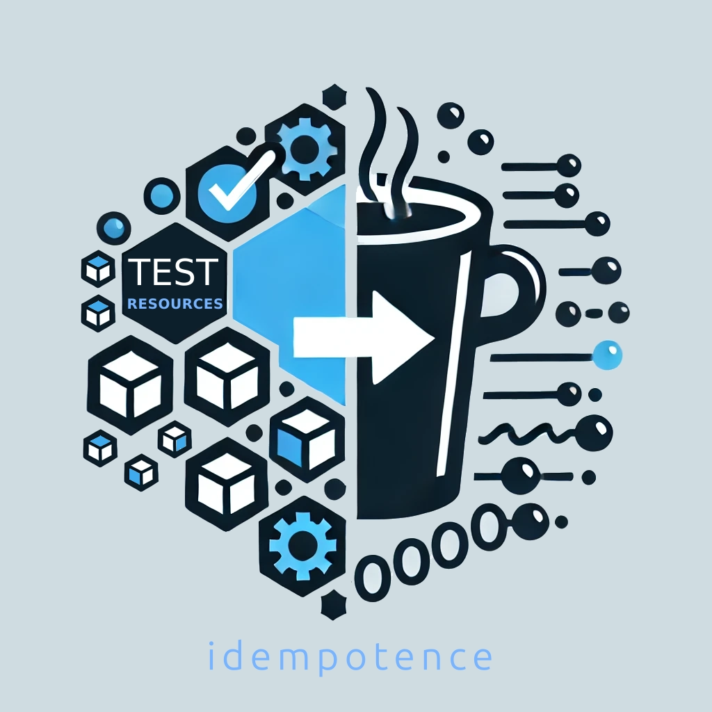

  

Welcome to the Idempotence project!

Idempotence is a Java testing framework for isolating shared test resources in a way that tests can be idempotent and
run safely in parallel.

You can find our documentation [here](https://carlspring.github.io/idempotence/).

